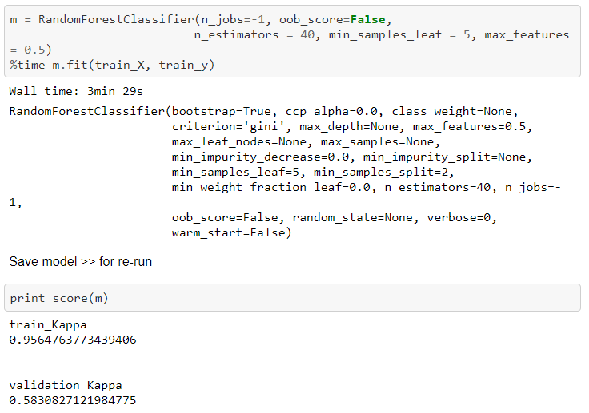

# Kaggle DSBowl 2019

First machine learning project implemented to test my knowledge of Random Forest Classifier as introduced in FastAI's introduction to machine learning course.

There are two notebooks in this project.  
* actual.ipynb - The full steps I've taken (including debugging and reasoning)
* submission.ipynb - Removed all unnecessary steps, straight-forward notebook to produce the submission file (csv).

## Libraries
* FastAI v0.7x
* Functions to calculate Quadratic Weighted Kappa

## Datasets Provided
* train.csv - contains the main features
* train_labels.csv - the actual labels for the training set
* test.csv - features of a test set

The goal of this project is to classify the accuracy_group of a participant based on the results of the games he/she has played.

## Data Cleaning
1. Inner merge the training features with the training labels (to form 865k observations, on 16 columns).  

2. Training and test dataframes were saved as feather files which makes them lighter and faster to be read.  

3. Unecessary or non-predictive columns were dropped. New dataframe is saved.  
  
Some of these variables are not provided in the test set. They were provided for informational purposes or as intermediate prediction labels.
4. event_data column is of JSON format, containing multiple types of information within.  
  
5. Some columns have list elements as their entries, using the explode function, each element in the list is given a new row.
  
6. There are columns in nested JSON format, the process of extracting these information is tedious and results in very little additional information, hence these columns are dropped.
  
7. Unnecessary columns timestamp and installation_id are dropped.

## Pre-processing
1. Convert data type of categorical columns.
2. Numericalise the categorical values, impute missing values with mean or mode, and one-hot encode categorical variables. Finally, split into features and labels.  
  
3. Validation Set split (80/20)

## Trial Run
Using a very basic Random Forest Classifier, a model is fitted and evaluated on the training and validation sets.
  
As observed, the model severely overfits to the training set.

### Side Note
At each step, I will create backups and shortcuts to refer to the objects I created in the python workspace for convenience. For example,  
  

These steps will not be explicitly mentioned below.

## Interpretations
1. Feature Importance  
  
Feature importance is a great feature of Random Forest Classifier or Regressor. By plotting the feature importance, I was able to identify significant variables to help predict the accuracy_group.

I retained only variables with feature importance greater than 0.010, corresponding to 15 variables.  
  

Again, a simple Random Forest Classifier model is fitted and evaluated on this new dataset.  
  
The only improvement is that significantly less time is needed to train the model. In general, the less features we retain, the poorer the prediction.  
  

2. Dendrogram
To identify similar variables, a dendrogram was plotted.  
  
For this section, Out-of-Bag (OOB) Score will be used to compare different datasets.

Columns that are similar were taken out one at a time to identify their effects.  
  
Two variables are identified to be redundant, hence they are removed.

A Random Forest Classifier is again fitted.
  
Overfitting is significantly reduced. Validation kappa increased from 0.5826 to 0.6161

## Fine-tuning
Using randomised hyperparameters search, the best hyperparameters are obtained as follows.  
  

## Final Model
Using only the significant variables as found above, together with the best hyperparameters identified, the final model is fitted.  
  

The validation kappa increased to 0.6267, which is the best performance so far.

## Predictions
The pre-processing steps were applied to the test set to ensure compatibility with the model obtained. Although a complete set of predictions were obtained, due to some unknown technical issues, the notebook and submission file were unable to be uploaded to Kaggle for evaluation.

Hence, the only performance metric for this model is the validation kappa, which is higher than all the test set kappa on the Kaggle leaderboard after the deadline.